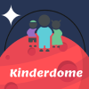
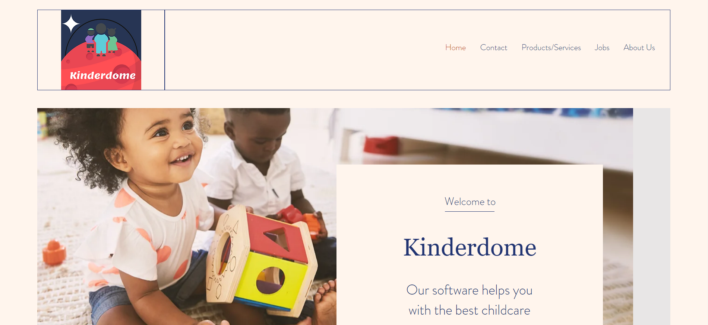
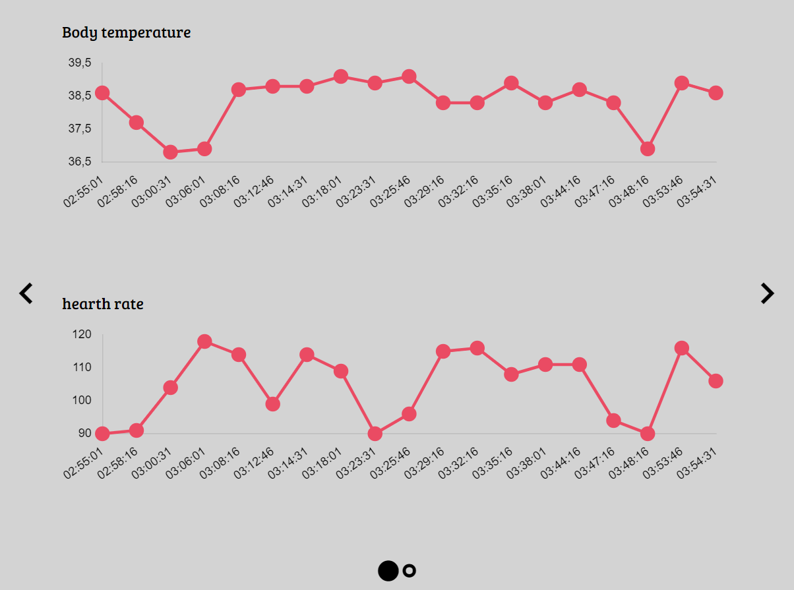
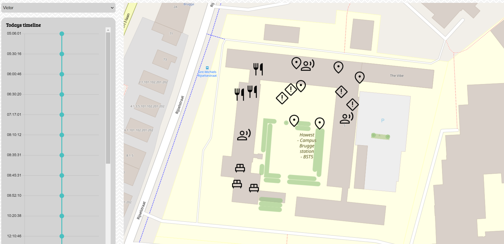

# Mars Kinderdome project group-16
  

## Table of content
- [Mars Kinderdome project group-16](#mars-kinderdome-project-group-16)
	- [Table of content](#table-of-content)
	- [Introduction](#introduction)
		- [The team](#the-team)
	- [SonarQube](#sonarqube)
		- [Client](#client)
		- [Server:](#server)
	- [D1: Bussiness Case](#d1-bussiness-case)
	- [D2: Marketing website](#d2-marketing-website)
	- [D3: Schematic](#d3-schematic)
	- [D4: Wireframes](#d4-wireframes)
	- [D5: Proof Of Concept](#d5-proof-of-concept)
		- [Technical requirements:](#technical-requirements)
		- [1. Extensive use of CSS compiler SASS features - Level 1](#1-extensive-use-of-css-compiler-sass-features---level-1)
		- [2. MediaStream ImageCapture API](#2-mediastream-imagecapture-api)
		- [3. Push notifications (via ~~Push API~~ and Notification API)](#3-push-notifications-via-push-api-and-notification-api)
		- [2. Graphs (Chart.js)](#2-graphs-chartjs)
		- [3. Maps](#3-maps)
	- [D6: Publicly accessible API](#d6-publicly-accessible-api)
	- [D7: Readme](#d7-readme)
## Introduction
At Kinderdome, we aim to provide high-quality software for childcare on Mars. To make this possible, we create/use quality software, making it easier for carers to do their daily work.
### The team
|||
|:--|:--|
|Victor Barra|AI Business Professional|
|Robin Monseré|Software Engineer|
|Sebastiaan Sillis|Cyber Security Profesional|
|David Bekkers|Cyber Security Profesional|
|Mats Fiers|Cyber Security Profesional|
## SonarQube
### Client

### Server:

## D1: Bussiness Case
Here you can find our bussiness case, it is a detailed explanaition of how the company will start and evolve over the first few years.   
[Link to the business case.](https://docs.google.com/document/d/1hpRvdymAuW0BH_3Pw7uPG_IBMY9em1w0J-xlI-8oSQE/edit?usp=sharing)
## D2: Marketing website
[Link to the Marketing website.](https://matsfiers.wixsite.com/kinderdome)

## D3: Schematic

[Link to the schematics.](https://git.ti.howest.be/TI/2022-2023/s3/analysis-and-development-project/projects/group-16/documentation/-/wikis/Schematics)

## D4: Wireframes
After we had an idea of what we wanted to make, we started creating wireframes. These where important for further development of the application. We also had multiple 3rd year students user test our wireframes. After this, we implemented several changes like adding icons, bigger fonts or removing useless information.   
[Link to the wireframes.](https://www.figma.com/proto/L0Ve3yJilhLARZKamwhAfM/Wireframes-after-feedback?node-id=68%3A35&scaling=scale-down&page-id=0%3A1&starting-point-node-id=68%3A35&show-proto-sidebar=1)
## D5: Proof Of Concept
### Technical requirements:
- ### Self-study topics:
   ### 1. Extensive use of CSS compiler SASS features - Level 1  
		For the styling of the project we opted to use Sass instead of CSS.  
		\- [Documentation](https://sass-lang.com/documentation/)

   ### 2. MediaStream ImageCapture API  
		The ImageCapture interface provides methods for capturing images or videos from a camera on your device.  
		We used it for our calling feature that both parent and caretaker have acces to.  
		\- [MediaStream documentation](https://developer.mozilla.org/en-US/docs/Web/API/MediaStream_Image_Capture_API)  

   ### 3. Push notifications (via ~~Push API~~ and Notification API)  
    - The notification API provides an interface to create notifications from the browser.  
   	We use this feature to send notifications to the user when they receive a message in the chat.  
   	Mind that this only works when the application is active and the user has notifications enabled. We opted to not add a popup for enabeling notifications as this is something that should be located in a settings page. This is something we do not yet have.  
	\- [Notification API documentation](https://developer.mozilla.org/en-US/docs/Web/API/Notification)

    - We did not (yet) implement the Push API.

- ### Class taught topics:
	### 1. Real-time communication
	- In our application a parent and caretaker can chat to eachother. This was achieved with the use of vertx Eventbus and socksJS.     
	\- [SocksJs Github](https://github.com/sockjs/sockjs-client?utm_source=cdnjs&utm_medium=cdnjs_link&utm_campaign=cdnjs_library)  
	\- [EventBus Github](https://github.com/bcerati/js-event-bus)  

	
   ### 2. Graphs (Chart.js)
	- Our application can display certain information about a child in different ways, one way we do this is via charts. 
	\- [Charts.js documentation](https://www.chartjs.org/)  
	  

   ### 3. Maps 
	- Both parent and caretaker can easily see where the child did what using our map page and act accordingly.  
    We used openlayers for the implementation of our map. 
	\- [Openlayers documentation](https://openlayers.org/)  
	

## D6: Publicly accessible API
Our entire API is publicly accesible. For the purposes of this POC, we have not implemented any authentication.  
[Simple overview of our API.](https://git.ti.howest.be/TI/2022-2023/s3/analysis-and-development-project/projects/group-16/documentation/-/wikis/Open-Api)  
[Link to the swagger openAPI spec.](https://project-ii.ti.howest.be/monitor/swagger-ui/?url=https://project-ii.ti.howest.be/monitor/apis/group-16)

## D7: Readme
You can find the Readme for the client and server below:

*  [Client README](https://git.ti.howest.be/TI/2022-2023/s3/analysis-and-development-project/projects/group-16/client/-/blob/main/README.md)
* [Server README](https://git.ti.howest.be/TI/2022-2023/s3/analysis-and-development-project/projects/group-16/server/-/blob/main/readme.md)

